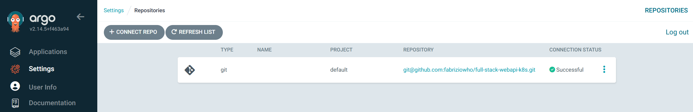

# Full-Stack WebApi on Kubernetes

# Introduction

This repository contains the code for building a simple web application based on Node.js that exposes an API to query a PostgreSQL database. The goal of this project is to deploy infrastructure components using **Infrastructure as Code (IaC)**, leveraging **Terraform** to ensure the integrity of the infrastructure.

Additionally, the project uses **Argo CD** for managing **GitOps** deployment of a Helm-based Kubernetes webapp, offering a modern and automated approach to continuous delivery.

The main implementation steps are as follows:

1. **Prepare the Kubernetes Architecture**
    - Deploy CrunchyData Postgres Operator
    - Deploy Argo CD via Helm and configure it
    - Deploy the PostgreSQL cluster using Argo CD
    - Configure PostgreSQL cluster
2. **Deploy the Web API**
    - Backend API
    - Frontend application
3. **Deploy Helm Chart Components**

This case study demonstrates the following core concepts:

- **Infrastructure as Code (IaC)**
- **GitOps**
- **Containerization**

<aside>
👉

Is it possible to adopt alternative strategies and technologies? Absolutely! This project is flexible and allows for different approaches in deploying components. 

</aside>

---

# Prerequisites

- Kubernetes cluster v1.32.2 (using Docker Desktop in this case)
- Terraform v1.11.2

---

# Architecture

Below is the architecture along with the components used:

---

# 1. Preparing the Architecture Components

The first step is to deploy all the components required for the webapp.

## a. Deploy CrunchyData Postgres Operator

The **CrunchyData Postgres Operator** is deployed to handle PostgreSQL instances and provides built-in backup and replication services.

### Deployment via Terraform (Helm Provider):

```hcl
resource "helm_release" "crunchy_operator" {
    name       = "crunchy-operator"
    chart      = "pgo"
    version    = "5.7.4"
    repository = "oci://registry.developers.crunchydata.com/crunchydata"
    namespace  = "default"
}
```

---

## b. Deploy Argo CD via Helm

1. Create the Argo CD namespace in your Kubernetes cluster:

```bash
kubectl create namespace argocd
```

1. Deploy Argo CD via Helm into the newly created namespace:

```bash
helm repo add argo https://argoproj.github.io/argo-helm /
helm install argocd argo/argo-cd -n argocd
```

1. Open the Argo CD UI and configure the repository for fetching the configuration:



---

## c. Deploy PostgreSQL Cluster via Argo CD

The **CrunchyData Postgres Operator** provides Custom Resource Definitions (CRDs), such as `PGCluster`, for deploying PostgreSQL clusters. This step deploys the PostgreSQL cluster via Argo CD and Terraform using the Helm provider.

### Example Terraform Code for Argo CD Application:

```hcl
resource "argocd_application" "postgres_cluster" {
  metadata {
    name      = "postgres-cluster"
    namespace = "argocd"
  }

  spec {
    project = "default"

    source {
      repo_url        = "git@github.com:fabriziowho/full-stack-webapi-k8s.git"
      target_revision = "main"
      path            = "k8s-app/helm/postgres-cluster"

      helm {
        value_files = ["values.yaml"]
      }
    }

    destination {
      namespace = "default"
      server    = "https://kubernetes.default.svc"
    }

    sync_policy {
      automated {
        self_heal = true
        prune     = true
      }

      sync_options = [
        "CreateNamespace=true"
      ]
    }
  }
}

```


---

## d. Configure PostgreSQL Cluster

Example PostgreSQL configuration script:

```sql
-- Step 1: Create a new schema
CREATE SCHEMA webapp;

-- Step 2: Grant CREATE permission to your user
GRANT CREATE ON SCHEMA webapp TO "postgres-cluster";

-- Step 3: Set the search path to include the new schema
SET search_path TO webapp, public;

-- Step 4: Create a table in the new schema
CREATE TABLE webapp.users (
    id SERIAL PRIMARY KEY,
    name VARCHAR(100) NOT NULL,
    email VARCHAR(100) NOT NULL
);

```

### Populate the `users` table with seed data:

```sql
INSERT INTO users (name, email) VALUES ('John Doe', 'john@example.com');
INSERT INTO users (name, email) VALUES ('Jane Smith', 'jane@example.com');
```

---

# 2. Deploying the Web API

## a. Backend API

The backend API manages database queries through a Node.js-based API. It uses Swagger for API testing.

### Testing Locally

To test locally, you'll need to port-forward the PostgreSQL service to allow communication between the host and the database. The backend API is working as expected once the communication is established.


## b. Frontend

The frontend is built with React and communicates with the backend API via the `/users` endpoint to fetch user data.

An **NGINX** ingress controller is used to manage routing within the Kubernetes cluster.

### Frontend Test Results


---

# 3. Deploying Helm Chart Components

## a. Adjust Environment Variables

To deploy the app in Kubernetes, the application is converted into a Helm chart. Database parameters are passed through Helm values files, ensuring sensitive data is not hardcoded.

Once the Backend API Helm Chart deployment it will consuming the values inside the secret deployed with the DB Cluster.

### Backend API Configuration

```jsx
// Set up PostgreSQL connection
const pool = new Pool({
  user: process.env.DB_USER,
  host: process.env.DB_HOST,
  database: process.env.DB_NAME,
  password: process.env.DB_PASSWORD,
  port: process.env.DB_PORT,
});
```

### Frontend Configuration

```jsx
// Fetch users from the API
  useEffect(() => {
    axios.get("/users")
      .then(response => {
        setUsers(response.data);
        setLoading(false);
      })
      .catch(() => {
        setError('An error occurred while fetching the data');
        setLoading(false);
      });
  }, []);
```

---

## b. Deploy Helm Chart App via Argo CD

Argo CD will manage the deployment of the Helm chart, ensuring a smooth CI/CD pipeline.

### Example Argo CD Application YAML:

```yaml
apiVersion: argoproj.io/v1alpha1
kind: Application
metadata:
  name: fe-api-webapp
  namespace: argocd
spec:
  project: default
  source:
    path: k8s-app/helm/webapp
    repoURL: git@github.com:fabriziowho/full-stack-webapi-k8s.git
    targetRevision: main
    helm:
      valueFiles:
        - values.yaml
  destination:
    namespace: default
    server: https://kubernetes.default.svc
  syncPolicy:
    automated:
      selfHeal: true
      prune: true
    syncOptions:
      - CreateNamespace=true

```


---

# Conclusion

This project demonstrated how to deploy a full-stack web application using Kubernetes, Terraform, Helm, and Argo CD, with a focus on **Infrastructure as Code (IaC)**, **GitOps**, and **Containerization**.

By integrating these technologies, we were able to automate the entire deployment pipeline—from infrastructure provisioning to application management—ensuring consistency, scalability, and maintainability. Key benefits include:

- **Automated Infrastructure Management**: Using Terraform to deploy Kubernetes components ensures that infrastructure is reproducible and easy to maintain.
- **GitOps with Argo CD**: The integration of Argo CD streamlines continuous deployment by allowing the application to be fully managed through Git repositories.
- **Containerization**: Leveraging Docker and Kubernetes ensures that the application is highly portable and scalable, simplifying deployment across different environments.

In the future, this setup could be extended with additional monitoring and logging tools, improved CI/CD pipelines, or further optimization for handling larger-scale traffic. Additionally, adopting other strategies or technologies could improve certain aspects of the deployment, such as using managed Kubernetes services or exploring more advanced database replication strategies.

Ultimately, this project serves as a strong foundation for building cloud-native applications with modern infrastructure management practices, and it is flexible enough to be adapted or extended based on specific requirements.